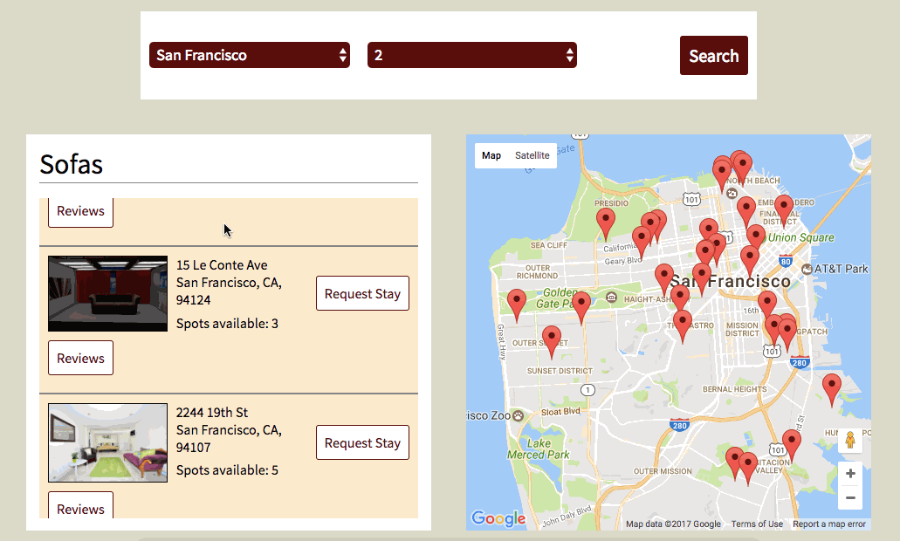
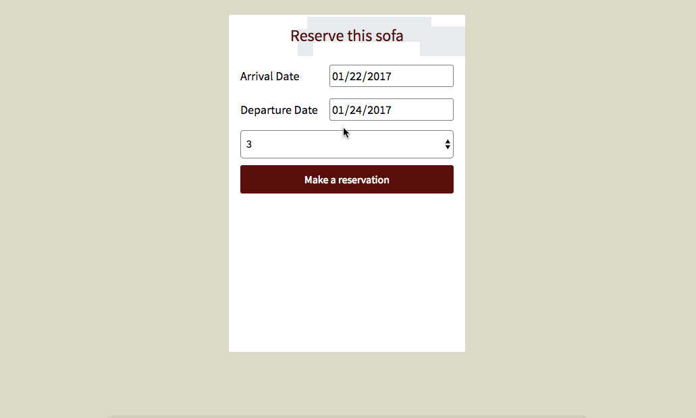
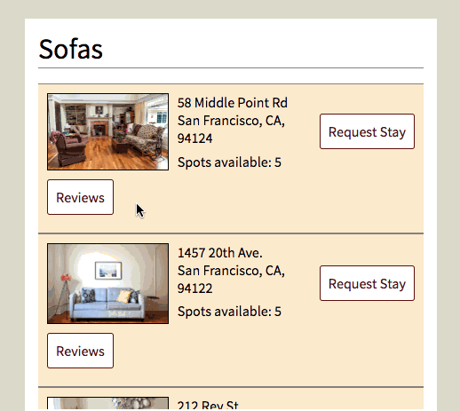

# Sofahopping

[Sofahopping](www.sofahopping.club) is a single-page site based on
Couchsurfing where users can easily find a place to stay when traveling.
It utilizes Ruby on Rails on the backend, a PostgreSQL database, and
React/Redux on the frontend.

## Features

### Search with Map
By changing the search parameters in the search box, the user can control
the available sofas that show up in the sofas list and map.

### Bookings
Bookings are what connects users to their hosts and the host's available
sofas. Once a successful booking is created, the user's bookings list
will be displayed sorted by arrival date. This contains all the necessary
information the user needs in order to have a successful stay.

### Reviews
Reviews can be added to any of the sofas in the sofas list. Users are
able to view all the reviews for any sofa as well as update and delete
their own reviews.

## Future directions

### More search parameters
Currently, users are only able to choose from a few predetermined cities
and a certain number of guests. I'd like to implement a dynamic search
which is able to filter using the map boundaries and show the specific
marker on the map of the sofa the user is currently hovering over.

### User Profiles
I would like to add user profiles in which Users will be allowed to
make changes to their personal information as well as send and receive
messages from other users.

### Confirm/Reject Booking Requests
Implementing the ability to confirm or reject another user's booking
request is another area of focus I will work on. This ensures that
hosts can decide who they let stay inside their own homes.
